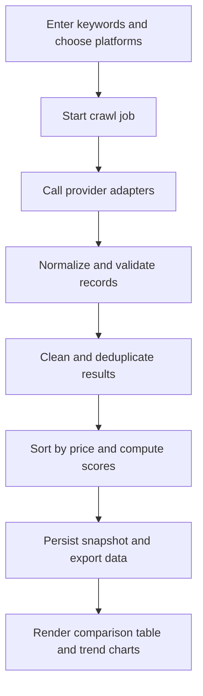

## 1. Product Overview
An automated product price intelligence tool that batch-collects search results from multiple e-commerce sources, normalizes and compares offers, and presents price trends plus recommendation signals in both CLI and web views.
- Solves the workflow of manually searching JD.com, Taobao, and Pinduoduo for the same product, then copying prices into spreadsheets for comparison.
- Targets merchants, sourcing teams, category analysts, and price-sensitive consumers who need fast cross-platform snapshots and repeatable comparison outputs.

## 2. Core Features

### 2.1 User Roles
| Role | Access Method | Core Permissions |
|------|---------------|------------------|
| Analyst / Operator | Local CLI or web UI session | Run keyword search tasks, inspect results, export reports, view seeded demos |

### 2.2 Feature Module
1. **Workbench page**: keyword input, platform selection, run controls, seeded demo selector.
2. **Comparison dashboard**: result list, horizontal comparison table, recommendation labels, trend chart, export entry.
3. **CLI tool**: batch keyword execution, provider orchestration, local storage, report output.

### 2.3 Page Details
| Page Name | Module Name | Feature Description |
|-----------|-------------|---------------------|
| Workbench page | Keyword runner | Accepts one or multiple keywords, optional platform filters, max result count, and data source mode |
| Workbench page | Run status panel | Shows current crawl stage, provider progress, warnings, and elapsed time |
| Workbench page | Demo dataset switcher | Loads bundled sample input and sample result snapshots during initialization |
| Comparison dashboard | Result cards | Shows product name, normalized price, monthly sales, store score, provider, and direct product link |
| Comparison dashboard | Horizontal comparison table | Aligns records by keyword and normalized attributes for side-by-side evaluation |
| Comparison dashboard | Recommendation labels | Adds signals such as "Lowest Price", "Best Store Score", "High Sales", and "Best Value" |
| Comparison dashboard | Trend chart | Displays historical minimum / average / median price snapshots by keyword |
| Comparison dashboard | Export block | Supports JSON and CSV export for cleaned result sets |
| CLI tool | Batch task runner | Consumes keyword lists from command line or file input and runs provider adapters in sequence or parallel |
| CLI tool | Data processing pipeline | Cleans fields, removes duplicates, sorts by price ascending, scores value-for-money, and stores snapshots |

## 3. Core Process
Users enter one or more product keywords, choose the enabled platforms, and trigger a run. The system queries each provider adapter, transforms platform-specific fields into a unified product schema, cleans and deduplicates the records, computes comparison metrics and recommendation labels, stores the new price snapshot locally, and renders sortable visual outputs for current and historical views.

## 4. User Interface Design
### 4.1 Design Style
- Primary palette: deep graphite background, warm ivory surfaces, and electric cyan / amber accents for comparison signals
- Button style: rounded rectangular controls with subtle glow states and dense data-tool styling
- Typography: a distinctive display font for headings paired with a readable serif or neo-grotesk body font for analysis-heavy panels
- Layout style: desktop-first command center with a left control column and right analytics canvas
- Icon style: thin-line analytical icons from a consistent library, with restrained badge chips for recommendation states

### 4.2 Page Design Overview
| Page Name | Module Name | UI Elements |
|-----------|-------------|-------------|
| Workbench page | Header | Product title, short positioning copy, live provider status indicators |
| Workbench page | Search form | Keyword textarea, platform toggles, result limit slider, mode selector, run button |
| Workbench page | Seeded examples | Clickable sample keywords and sample run cards |
| Comparison dashboard | Summary strip | Lowest price, average price, source count, best value summary |
| Comparison dashboard | Result list | Dense offer rows with provider badge, price emphasis, sales/store metrics, and action link |
| Comparison dashboard | Comparison matrix | Sticky columns, sortable headings, recommendation chips, dedupe indicators |
| Comparison dashboard | Trend chart area | Multi-series line chart with hover tooltips and selectable keyword history |
| Comparison dashboard | Insight panel | Explanation of recommendation score and data quality warnings |

### 4.3 Responsiveness
Desktop-first design with tablet adaptation. The control panel collapses above the analytics view on narrower screens, while long tables switch to horizontally scrollable comparison bands. Touch targets and chart tooltips remain accessible on tablet layouts.

## 5. Data Scope And Output Rules
- Required collected fields: keyword, platform, product name, current price, original price if available, monthly sales or order count, store name, store rating, product URL, thumbnail if available, crawl timestamp
- Normalized derived fields: cleaned title, numeric price, canonical vendor key, dedupe fingerprint, recommendation score, labels, trend group identifier
- Sorting default: ascending by numeric current price
- Deduplication rule: remove duplicate rows that match normalized keyword, normalized title fingerprint, platform, vendor, and near-identical price band
- Historical storage: save one snapshot per run for trend visualization and later comparison
- Recommendation logic: combine low price ranking, sales confidence, store quality, and discount signal into a value-for-money label

## 6. Demo And Initialization Requirements
- The project must ship with a bundled sample dataset covering at least three keywords and three platforms, plus precomputed sample comparison results
- The web page must allow running the demo immediately after initialization without external credentials
- The CLI must include a demo command that loads the sample dataset and prints a comparison report
- Real provider adapters must be implemented with a pluggable interface so the project can support legal scraping, official APIs, or browser automation depending on platform constraints

## 7. Non-Functional Requirements
- Provide a runnable local CLI command and a local web demo
- Keep adapter implementations isolated so platform-specific changes do not affect the rest of the pipeline
- Surface crawl failures and partial-provider errors without blocking all results
- Preserve traceability by recording crawl timestamp, provider name, and raw field provenance where possible
- Ensure the default demo mode works offline from bundled sample data
