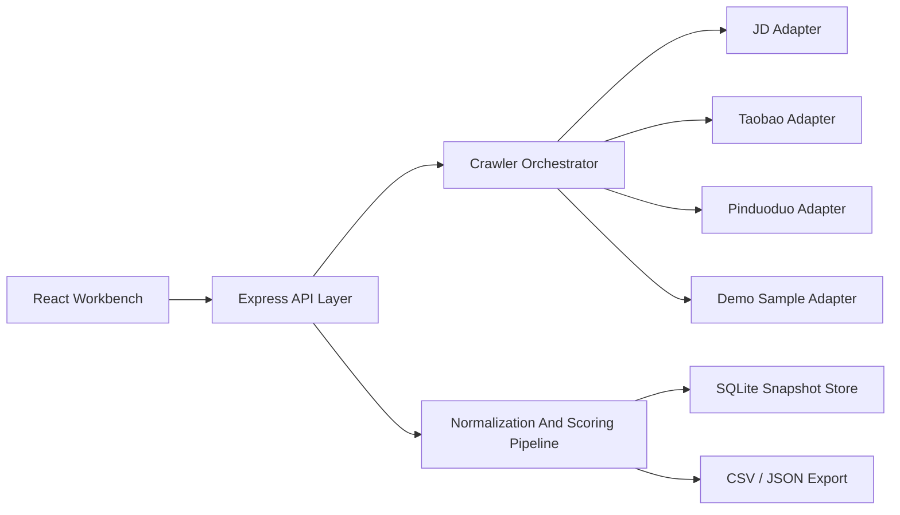
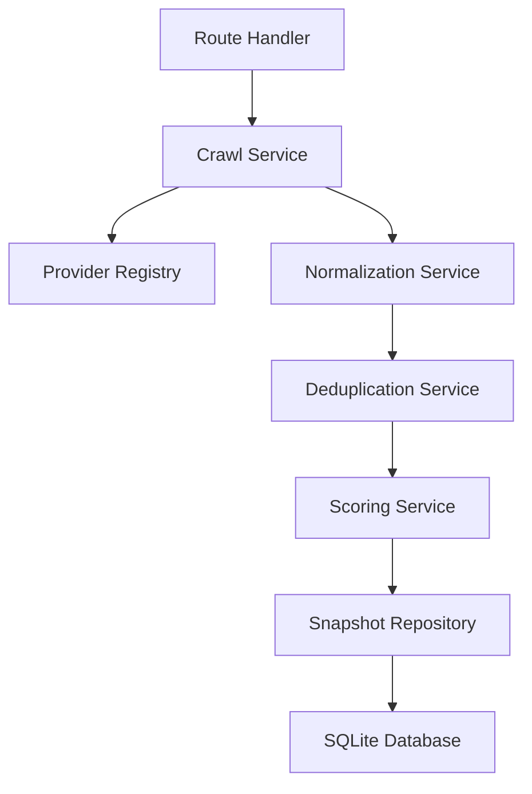
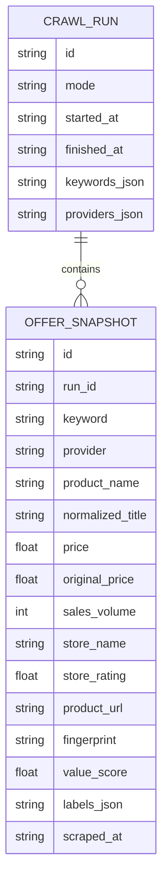

## 1. Architecture Design


## 2. Technology Description
- Frontend: React 18 + TypeScript + Vite + Tailwind CSS + Zustand
- Visualization: Recharts for price trend lines and comparison-friendly summary charts
- Backend: Express 4 + TypeScript running in the same subproject for local demo orchestration
- Storage: SQLite for snapshot history plus JSON seed files for bundled demo mode
- CLI: Node.js TypeScript entrypoint using commander and shared services from the backend domain layer
- Testing: Vitest for data processing and scoring logic, plus API smoke checks via local HTTP requests

## 3. Project Structure
| Path | Purpose |
|------|---------|
| `price-compare-app/src` | React pages, components, state, and chart rendering |
| `price-compare-app/api` | Express server routes, crawler services, adapter registry, and storage access |
| `price-compare-app/shared` | Shared TypeScript types, DTOs, and scoring helpers |
| `price-compare-app/data` | Sample seed datasets and exported run artifacts |
| `price-compare-app/tests` | Pipeline and API tests |

## 4. Route Definitions
| Route | Purpose |
|-------|---------|
| `/` | Workbench page with keyword input and seeded sample launcher |
| `/dashboard` | Comparison-focused analytics view for the most recent run |

## 5. API Definitions
### 5.1 Shared Types
```ts
export type ProviderName = "jd" | "taobao" | "pinduoduo" | "demo";

export interface CrawlRequest {
  keywords: string[];
  providers: ProviderName[];
  limitPerProvider?: number;
  mode: "demo" | "live";
}

export interface RawOffer {
  keyword: string;
  provider: ProviderName;
  productName: string;
  priceText: string;
  salesText?: string;
  storeName?: string;
  storeRatingText?: string;
  productUrl: string;
  scrapedAt: string;
  rawPayload?: Record<string, unknown>;
}

export interface NormalizedOffer {
  id: string;
  keyword: string;
  provider: ProviderName;
  productName: string;
  normalizedTitle: string;
  price: number;
  originalPrice?: number;
  salesVolume?: number;
  storeName?: string;
  storeRating?: number;
  productUrl: string;
  scrapedAt: string;
  fingerprint: string;
  labels: string[];
  valueScore: number;
}
```

### 5.2 Endpoints
| Method | Endpoint | Purpose |
|--------|----------|---------|
| `POST` | `/api/crawl` | Run a keyword crawl in `demo` or `live` mode and return the cleaned result set |
| `GET` | `/api/runs/latest` | Return the latest processed comparison payload |
| `GET` | `/api/runs/history?keyword=` | Return stored trend snapshots for one keyword |
| `GET` | `/api/seeds` | Return available sample keywords and example result presets |
| `GET` | `/api/export/latest?format=json|csv` | Export the latest processed run |

## 6. Server Architecture Diagram


## 7. Data Model
### 7.1 Data Model Definition


### 7.2 Data Definition Language
```sql
CREATE TABLE crawl_runs (
  id TEXT PRIMARY KEY,
  mode TEXT NOT NULL,
  started_at TEXT NOT NULL,
  finished_at TEXT NOT NULL,
  keywords_json TEXT NOT NULL,
  providers_json TEXT NOT NULL
);

CREATE TABLE offer_snapshots (
  id TEXT PRIMARY KEY,
  run_id TEXT NOT NULL REFERENCES crawl_runs(id),
  keyword TEXT NOT NULL,
  provider TEXT NOT NULL,
  product_name TEXT NOT NULL,
  normalized_title TEXT NOT NULL,
  price REAL NOT NULL,
  original_price REAL,
  sales_volume INTEGER,
  store_name TEXT,
  store_rating REAL,
  product_url TEXT NOT NULL,
  fingerprint TEXT NOT NULL,
  value_score REAL NOT NULL,
  labels_json TEXT NOT NULL,
  scraped_at TEXT NOT NULL
);

CREATE INDEX idx_offer_snapshots_keyword_price
  ON offer_snapshots(keyword, price);

CREATE INDEX idx_offer_snapshots_keyword_scraped_at
  ON offer_snapshots(keyword, scraped_at);
```

## 8. Core Implementation Strategy
- Provider adapters expose a uniform `search(keyword, options)` method that returns raw offers plus provider warnings
- `demo` mode reads bundled JSON datasets so the app works immediately after setup
- `live` mode uses platform-specific fetchers behind each adapter, allowing HTML parsing, official APIs, or browser automation without changing pipeline code
- Normalization converts text prices, sales metrics, and store ratings into numeric comparable fields
- Deduplication uses normalized title tokens, provider/store identity, and price proximity to remove repeated offers
- Scoring calculates recommendation labels from weighted price rank, sales confidence, seller quality, and discount gap
- Snapshot persistence stores each processed run for trend charts and later exports

## 9. Risk And Constraint Handling
- E-commerce platforms may block direct scraping, so live adapters must support rate limiting, headers, retries, and optional browser-driven fetch strategies
- The default deliverable uses bundled sample data to guarantee a working local demo even when live collection is unavailable
- Provider failures return partial results with warning messages instead of failing the full run
- URL, pricing, and vendor provenance are stored so users can audit data freshness and source quality
